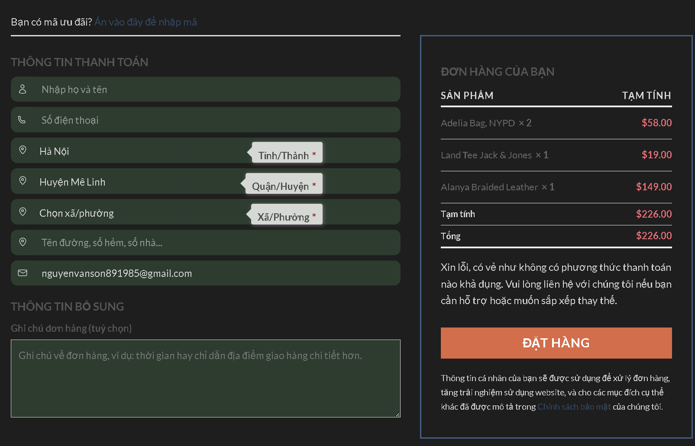
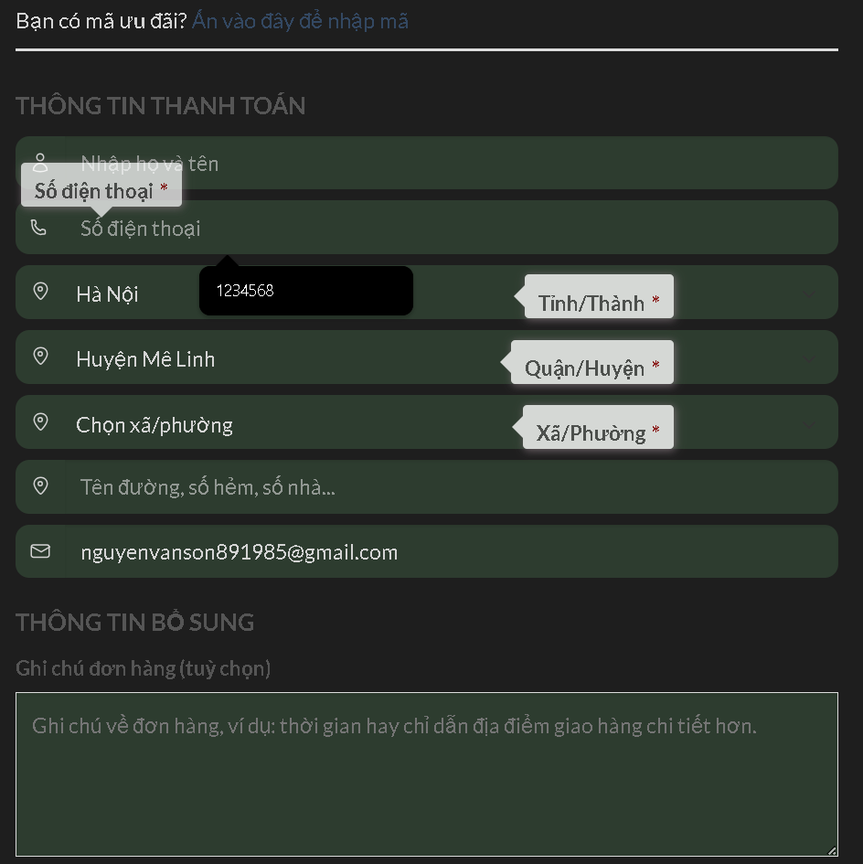
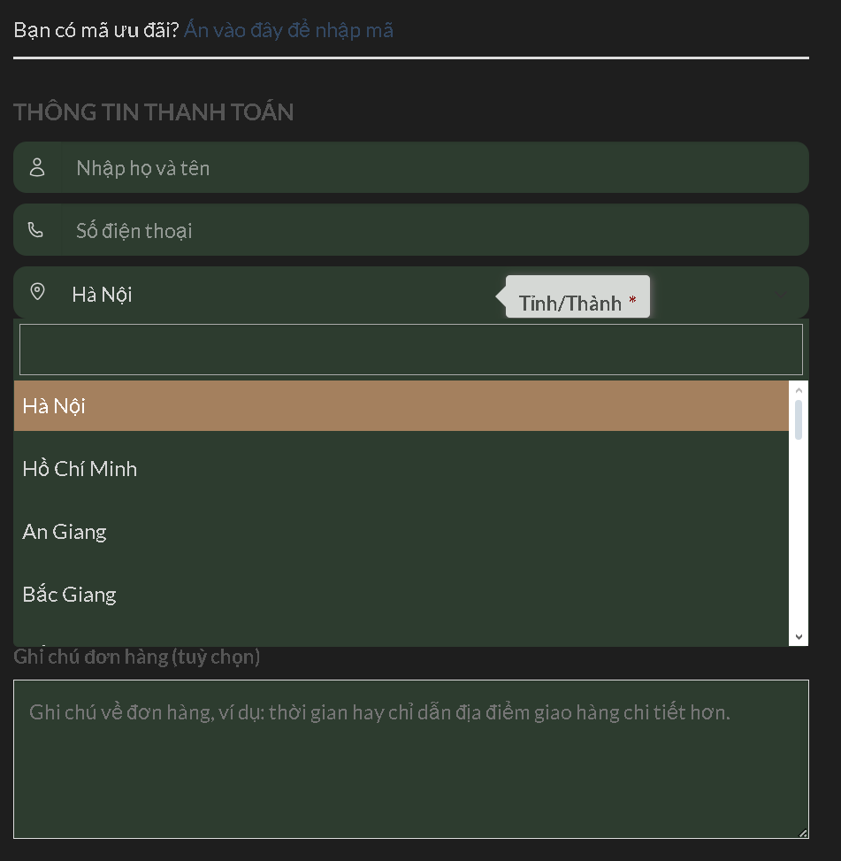
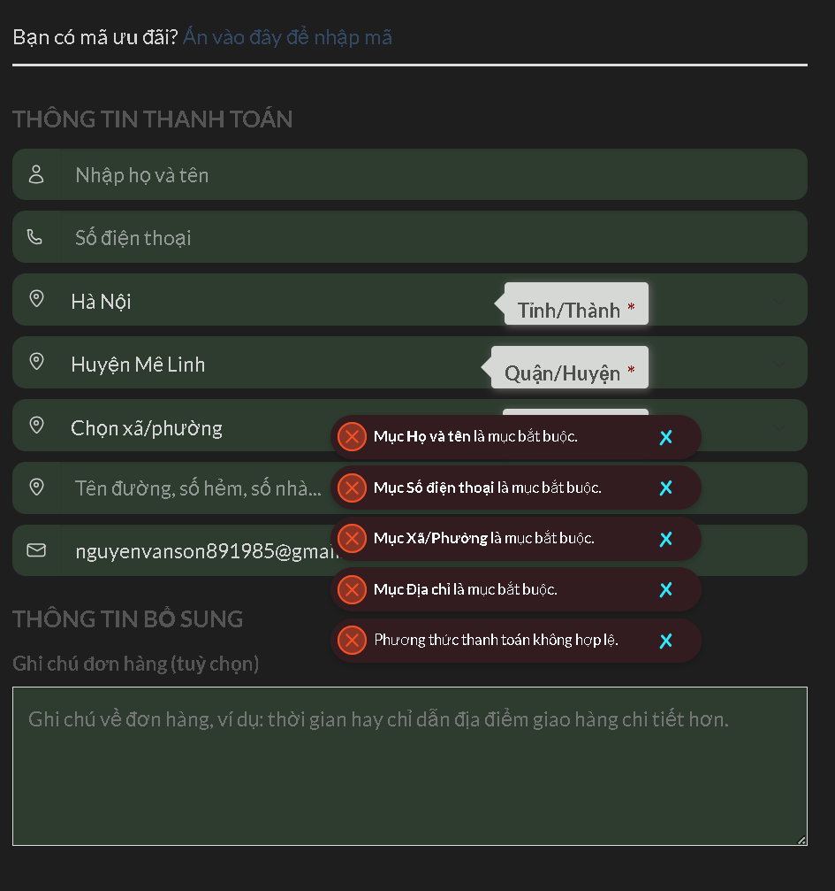

=== ithandech devvn checkout customizer ===
Contributors: laptrinhvienso0
Donate link: 
Tags: checkout, fields, woocommerce, custom, payment
Requires at least: 6.0
Tested up to: 6.7
Stable tag: 3.0
Requires PHP: 7.0
License: GPLv2 or later
License URI: https://www.gnu.org/licenses/gpl-2.0.html

Short Description: Allows you to customize address fields for Vietnamese addresses, including provinces, districts, and wards.

== Description ==

This is a custom checkout plugin for WooCommerce. It adds specialized billing address fields for Vietnamese addresses, making it easy to select provinces, districts, and wards.

== Frequently Asked Questions ==

= Where can I find the un-minified source code? =

All of our original, human-readable JavaScript and CSS is included under `assets/src/`. 
We use a build process to generate the files found in `assets/build/`.

= How do I rebuild these files myself? =

1. Make sure you have Node.js and npm installed.
2. From the plugin directory, run `npm install` to fetch all dependencies.
3. Run `npm run minify-js` and `npm run minify-css` to compile/minify the source code into `assets/build/`.
4. The final production-ready files will appear in the `assets/build/` directory.

We also maintain a GitHub repository (link below), where you can view the complete plugin source, including branches, commit history, and build scripts.

== Development & Source Code ==

You can view, fork, or contribute to our plugin’s source code on GitHub:
[https://github.com/Ping89/ithandech-devvn-checkout-customizer](https://github.com/Ping89/ithandech-devvn-checkout-customizer)

== Installation ==

Upload the plugin files to the `/wp-content/plugins/ithandech-devvn-checkout-customizer` directory, or install the plugin through the WordPress plugins screen directly.

= How to Get Started =

Install “woo-checkout-field-editor” (or a similar checkout field editor plugin) and adjust any billing fields as desired.  
To use this plugin effectively, you must include the following three fields:
- `billing_province_code` (select) – Province/City
- `billing_district_code` (select) – District
- `billing_ward_code` (select) – Ward

== Screenshots ==

1. Start screen: `/assets/overview.png`

2. Label Tooltips: `/assets/labelview.png`

3. Select VN Address: `/assets/select_vn_address_view.png`

4. Error Message view: `/assets/error_messages.png`

== Changelog ==

= 3.0 =
* Defined a new plugin slug.
* Fixed some function/class names for better convention.

= 2.0 =
* Defined a new plugin slug.
* Added scripts to build minified JS/CSS via Node.js.
* Changed some function/class names for better convention.

= 1.2 =
* Introduced a new skin.
* Added custom CSS/JS for error display.
* Displayed label tooltips.

= 1.0 =
* Initial plugin creation.

== Upgrade Notice ==

= 1.2 =
No special steps required.

== A brief Markdown ==

Markdown is what the parser uses to process much of the readme file.

[markdown syntax]: https://daringfireball.net/projects/markdown/syntax

Ordered list:

1. Edit billing and shipping addresses to match Vietnamese addresses.
2. Allow selecting provinces, districts, and wards via combo boxes.
3. Display more flexible error messages.

